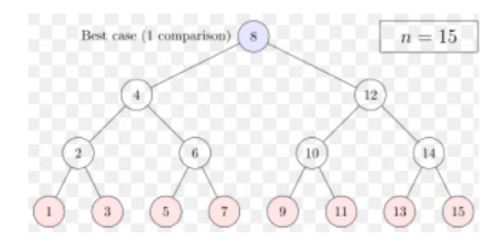

# Python - Dynamic Binary Tree

## This program will find the minimum cost of a binary tree using a Dynamic method

  
 ### STEP 1.
* Setup working environment, Header Notes/README.
I used Visual Studio Code and Python as my working environnment for this project. I then created a README file in my github account to display
and showcase my steps during the project. 

### STEP 2.
* We first create a function for DepthFirstSearch traversal which stores the maximum value for every node until it reaches every leave node

### STEP 3.
* The minimum value is set to an infinity value so that it can compare against it. This make it adaptable in case if more nodes are added to the binary tree

### STEP 4.
* The function will continue as long as the child is also a parent, then the DepthFirstSearch function will continue to traverse until no more child nodes are left.

### STEP 5. 
* we built the tree using a diagram with undirected edges and added the values into an array. 

### Result
* Finally we print the top most node (root node) of the tree which will contain the minimum summation from root to the each lower leave
